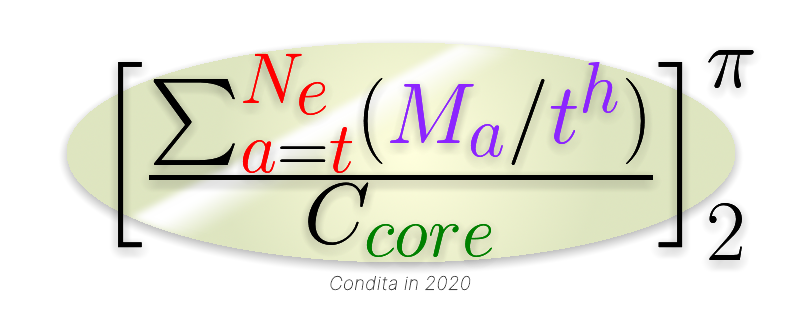

# NeatMathCore
 NMC is a math kernel built in .NET Core

<div align="center">

</div>

Logo in Latex:
```latex
\begin{bmatrix}
\frac{\sum_{{\color{Red}a}={\color{Red}t}}^{{\color{Red} N_e}}({\color{Purple} M_a}/{\color{Purple} t^h})}{C_{{\color{DarkGreen} core}}}
\end{bmatrix}_2^\pi
```
