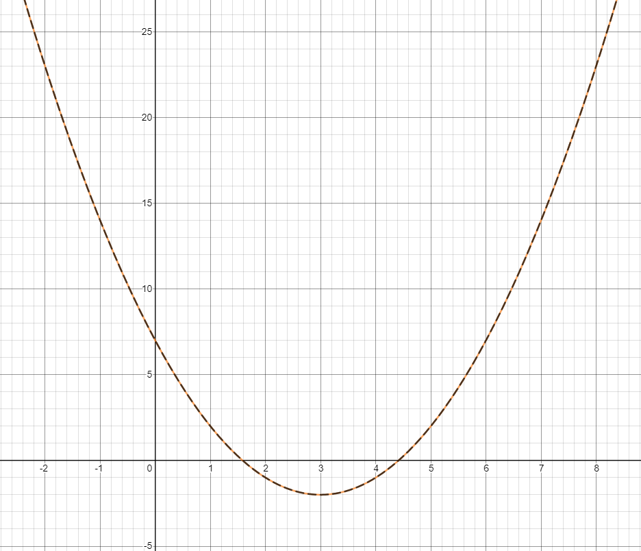

<div align="center">
 
 <h1>
  <em>Neat Math Core</em>
 </h1>
 <p>The NMC Kernel and its computation capabilities can be accessed through its command-line interface. Which allows NMC to be used in large-scale batch mode or as background computing environments.</p>
</div>


## Examples
This C# code below, creates a new polynomial abbreviated `f` and store it in `ext1` , then using the `ToStringExpression(...)` to factor the expression, and print the result with a new abbreviation `g`.

```c#
Polynomial ex1 = new Polynomial("f", new double[] { 1, -6 }, 7);
Console.WriteLine(ex1);
ex1.Designation = "g";
Console.WriteLine(ex1.ToStringExpression(true, true));
```

<!-- =\frac{x_1+x_2+x_3+...+x_n}{n}) -->

=x^2-6x+7)

=\(x-4.414213562373095\)\(x-1.5857864376269049\))


=\(x-3+\sqrt{2}\)\(x-3-\sqrt{2}\))
<!--$$
f(x)=x^2-6x+7\\
\Rightarrow \\
g(x)=(x-4.414213562373095)(x-1.5857864376269049)\\
or\\
g(x)=(x-3+\sqrt{2})(x-3-\sqrt{2})
$$-->
The two functions `f(x)` and `g(x)` are sure to be identical, not only sharing roots. But this can be configured and simplified even more.

Here's a graph of the two functions.

 


## Logo

* **LaTeX**

}{C_{{\color{DarkGreen}core}}}%20\end{bmatrix}_2^\pi)

```latex
\begin{bmatrix}
\frac{\sum_{{\color{Red}a}={\color{Red}t}}^{{\color{Red} N_e}}({\color{Purple} M_a}/{\color{Purple} t^h})}{C_{{\color{DarkGreen} core}}}
\end{bmatrix}_2^\pi
```

